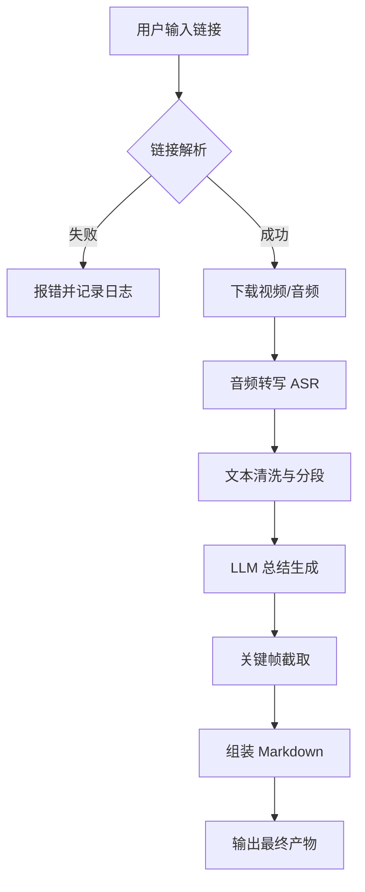

# 哔哩哔哩视频自动总结笔记工具 - 产品需求文档 (PRD)

| 文档版本 | 修改日期 | 修改人 | 修改描述 |
| :--- | :--- | :--- | :--- |
| V1.0 | 2023-10-27 | 产品团队 | 初始版本创建，整合功能、技术及运维需求 |
| V1.1 | 2023-10-30 | 产品团队 | 细化风险控制、监控指标及接口规范 |

---

## 一、项目背景与目标

### 1.1 项目背景
作为 B 站（哔哩哔哩）重度用户，日常观看大量知识类、教程类视频。然而，视频内容具有“流式”特性，看完后难以快速回顾重点，缺乏有效的沉淀和复盘机制。手动记录笔记耗时费力，且难以关联视频具体时间戳。

### 1.2 产品目标
打造一款自动化辅助工具，实现“输入链接 -> 输出结构化笔记”的闭环。
- **核心目标**：将视频内容转化为可检索、可阅读、带时间戳和配图的 Markdown 笔记。
- **效率目标**：单视频处理全流程自动化，人工干预最小化。
- **质量目标**：转写准确率>90%，总结内容逻辑清晰，关键信息无遗漏。

### 1.3 适用范围
- **首期**：个人本地部署使用，支持 Windows/macOS/Linux。
- **后期**：可扩展为多用户 SaaS 服务或支持更多视频平台（YouTube 等）。

---

## 二、用户分析

### 2.1 目标用户
- **核心用户**：本人及有强知识管理需求的 B 站用户。
- **用户画像**：
  - 学生/研究人员：需要整理课程、讲座视频。
  - 职场人士：需要复盘行业分享、技能教程。
  - 内容创作者：需要快速提取素材灵感。

### 2.2 使用场景
1. 发现优质长视频，希望快速获取大纲。
2. 观看完视频后，希望生成复习笔记。
3. 需要查找视频中某个具体知识点的画面和原文。

---

## 三、核心功能需求

### 3.1 视频下载模块
| 功能点 | 详细描述 | 优先级 |
| :--- | :--- | :--- |
| 链接解析 | 支持输入 B 站分享链接（BV/AV 号），自动解析视频元数据（标题、时长、P 数）。 | P0 |
| 多 P 处理 | 支持选择特定 P 或批量下载所有 P。 | P1 |
| 画质选择 | 默认下载 1080P，支持配置最高画质；需处理大会员/登录限制。 | P1 |
| 断点续传 | 下载中断支持续传，避免重复流量消耗。 | P2 |
| 代理支持 | 支持配置 HTTP/SOCKS 代理，适应网络环境。 | P2 |

### 3.2 音视频处理模块
| 功能点 | 详细描述 | 优先级 |
| :--- | :--- | :--- |
| 音轨分离 | 使用 `ffmpeg` 从视频中提取音频，转换为 16k/16bit mono WAV 或 MP3 以优化 ASR。 | P0 |
| 音频预处理 | 可选降噪处理（如 RNNoise），提升嘈杂环境下的转写准确率。 | P2 |
| 视频帧截取 | 根据笔记中的时间戳，自动截取关键帧图片，保存为 JPG/PNG。 | P1 |

### 3.3 语音转写 (ASR) 模块
| 功能点 | 详细描述 | 优先级 |
| :--- | :--- | :--- |
| 多后端支持 | 支持切换 ASR 引擎：本地 Whisper (GPU/CPU) / 云端 API (Azure/讯飞/百度)。 | P0 |
| 时间戳对齐 | 转写结果必须包含单词/句子级别的时间戳，用于后续定位。 | P0 |
| 语言识别 | 自动识别视频语言（中/英/日），或支持手动指定。 | P1 |
| 说话人区分 | (可选) 尝试区分不同说话人（Diarization），适用于访谈类视频。 | P3 |

### 3.4 笔记生成 (LLM) 模块
| 功能点 | 详细描述 | 优先级 |
| :--- | :--- | :--- |
| 文本分段 | 针对长文本，按语义或时间窗口进行切片，适配 LLM Context Window。 | P0 |
| 重点提取 | 提取核心观点、知识点、金句，并关联对应时间戳。 | P0 |
| 结构化输出 | 生成 Markdown 格式，包含标题、摘要、正文、时间戳链接。 | P0 |
| 配图关联 | 在 Markdown 中插入对应时间戳的视频帧图片路径。 | P1 |
| Prompt 配置 | 支持用户自定义 System Prompt，调整笔记风格（如康奈尔笔记、思维导图）。 | P2 |

### 3.5 文件管理模块
| 功能点 | 详细描述 | 优先级 |
| :--- | :--- | :--- |
| 目录归档 | 按 `BV 号` 自动创建独立文件夹，隔离不同视频产物。 | P0 |
| 命名规范 | 文件统一命名（如 `summary.md`, `video.mp4`），防止冲突。 | P0 |
| 清理策略 | 支持配置保留策略（如仅保留 Markdown，删除中间音频/视频）。 | P2 |

---

## 四、系统流程设计

### 4.1 业务主流程


### 4.2 产物目录结构
为保证多视频处理时的整洁性和可维护性，所有下载及中间产物均以 `bvid` 为唯一标识，存放于 `downloads/` 根目录下。

```text
project_root/
├── config.yaml              # 全局配置文件 (API Keys, 路径等)
├── logs/                    # 运行日志
├── downloads/               # 产物存储根目录
│   └── BV1xx2xx3xx/         # 以 BV 号命名的子文件夹
│       ├── meta.json        # 视频元数据 (标题，作者，发布时间)
│       ├── video.mp4        # 原始视频 (可选保留)
│       ├── audio.wav        # 提取的音频 (中间产物)
│       ├── transcript.json  # 带时间戳的原始转写文本
│       ├── transcript.srt   # 字幕文件 (可选)
│       ├── assets/          # 配图文件夹
│       │   ├── frame_001.jpg
│       │   └── frame_002.jpg
│       └── summary.md       # 最终生成的笔记
└── temp/                    # 临时文件缓存
```

---

## 五、接口规范 (内部模块)

为便于模块化开发和后续集成，各核心功能封装为独立函数/类，统一输入输出标准。

### 5.1 视频下载接口
- **功能**：下载视频及元数据。
- **输入**：`url` (str), `p_number` (int, optional), `cookies` (str, optional)
- **输出**：`dict`
  ```json
  {
    "status": "success",
    "bvid": "BV123456",
    "file_path": "downloads/BV123456/video.mp4",
    "meta": { "title": "...", "duration": 1200 }
  }
  ```

### 5.2 音频转写接口
- **功能**：音频转文本。
- **输入**：`audio_path` (str), `engine` (str: 'whisper'/'api')
- **输出**：`dict`
  ```json
  {
    "status": "success",
    "text": "全文内容...",
    "segments": [ {"start": 0.0, "end": 5.0, "text": "..."} ],
    "file_path": "downloads/BV123456/transcript.json"
  }
  ```

### 5.3 总结生成接口
- **功能**：调用 LLM 生成笔记。
- **输入**：`transcript_path` (str), `prompt_template` (str)
- **输出**：`dict`
  ```json
  {
    "status": "success",
    "markdown_content": "# 标题...",
    "frames": [ {"timestamp": 10.5, "desc": "关键图 1"} ],
    "file_path": "downloads/BV123456/summary.md"
  }
  ```

### 5.4 统一返回规范
所有接口需遵循统一的状态码规范，便于自动化脚本判断流程是否继续。
- `200`: 成功
- `400`: 参数错误
- `401`: 认证失败 (Cookie/API Key)
- `429`: 频率限制
- `500`: 内部错误/超时

---

## 六、风险控制与异常处理

### 6.1 视频下载风险
- **反爬机制**：B 站接口可能变动或增加验证。
  - *对策*：定期更新 `yt-dlp`；支持导入浏览器 Cookies；实现请求重试机制（Exponential Backoff）。
- **会员限制**：部分视频需大会员。
  - *对策*：配置中明确提示权限不足，支持传入大会员 Cookies。
- **网络波动**：大文件下载易中断。
  - *对策*：强制开启断点续传功能。

### 6.2 转写准确率风险
- **噪音/口音**：背景音大或口音重导致识别错误。
  - *对策*：支持多 ASR 后端切换（如 Whisper 识别不准时切换至云端 API）；增加音频降噪预处理步骤。
- **专业术语**：特定领域词汇识别错误。
  - *对策*：支持用户自定义热词表（Hotwords）。

### 6.3 大模型 (LLM) 风险
- **配额与成本**：API 调用超额或费用过高。
  - *对策*：配置每日 Token 上限；支持本地小模型（如 ChatGLM3-6B）作为备选。
- **超时与故障**：长文本处理易超时。
  - *对策*：实现文本分块（Chunking）处理；设置合理的 Timeout；捕获异常并保存中间状态，支持断点重试。
- **内容幻觉**：模型生成不实信息。
  - *对策*：Prompt 中强调“基于原文”，并在笔记中标注引用来源时间戳。

### 6.4 存储风险
- **磁盘爆满**：视频文件占用空间大。
  - *对策*：默认配置处理完成后删除 `video.mp4` 和 `audio.wav`，仅保留 `summary.md` 和 `assets`；定期清理脚本。
- **文件覆盖**：同名文件冲突。
  - *对策*：严格使用 BV 号作为目录名，BV 号唯一性由 B 站保证。

---

## 七、上线分析与监控

### 7.1 日志系统
- **日志级别**：
  - `INFO`: 流程节点（开始下载、转写完成、生成完毕）。
  - `WARN`: 重试、降级（如切换 ASR 引擎）。
  - `ERROR`: 关键失败（下载失败、API 报错），需包含 Stack Trace。
- **日志内容**：时间戳、模块名、BV 号、耗时、错误码。
- **存储**：本地文件轮转（log rotation），保留最近 7 天。

### 7.2 监控指标 (可选 Prometheus)
若部署为长期运行服务，建议监控以下指标：
- **成功率**：下载成功率、ASR 成功率、LLM 生成成功率。
- **性能**：单视频平均处理耗时、各阶段耗时分布。
- **资源**：CPU/GPU 利用率、内存峰值、磁盘剩余空间。
- **成本**：每日 API Token 消耗量估算。

### 7.3 告警机制
- **触发条件**：连续 3 次任务失败、磁盘空间低于 10%、API 配额耗尽。
- **通知方式**：本地弹窗、邮件、或推送至即时通讯工具（如钉钉/飞书 Webhook）。

---

## 八、资源计算与性能评估

### 8.1 单次处理资源估算 (以 10 分钟视频为例)
| 资源项 | 预估消耗 | 备注 |
| :--- | :--- | :--- |
| **带宽** | ~300MB | 取决于下载画质 (1080P) |
| **磁盘 IO** | ~500MB 写入 | 视频 + 音频 + 文本 + 图片 |
| **CPU** | 中负载 | ffmpeg 转码、文本处理 |
| **GPU** | 高负载 (可选) | 若使用本地 Whisper 大模型 |
| **API 额度** | ~2000 Tokens | 取决于总结详细程度 |
| **耗时** | 3-10 分钟 | 主要瓶颈在下载和 ASR |

### 8.2 并发处理建议
- **单用户模式**：串行处理，避免资源争抢。
- **批量模式**：
  - 限制最大并发数（如 2 个视频同时下载）。
  - 监控 API QPS，避免触发限流。
  - 增加队列管理，支持任务暂停/恢复。

### 8.3 性能优化建议
- **缓存机制**：若同一 BV 号已处理过，直接读取本地 `transcript.json` 跳过 ASR 步骤。
- **异步处理**：下载、转写、总结采用异步管道（Pipeline），提高吞吐量。
- **归档压缩**：对 `assets` 图片文件夹进行定期压缩，或生成后删除原视频。

---

## 九、非功能性需求

### 9.1 易用性
- **配置简化**：提供 `config.yaml` 模板，关键配置（API Key, 路径）开箱即用。
- **交互方式**：
  - 首期：命令行工具 (CLI)，支持参数 `python main.py --url <link>`。
  - 二期：简易 GUI 或 Web 界面，支持拖拽链接。

### 9.2 兼容性
- **操作系统**：确保 `ffmpeg` 和 `yt-dlp` 在 Win/Mac/Linux 下路径配置正确。
- **Python 版本**：锁定 Python 3.9+，提供 `requirements.txt`。

### 9.3 安全性
- **敏感信息**：Cookies 和 API Key 不得硬编码在代码中，必须通过配置文件或环境变量读取。
- **隐私保护**：所有处理在本地完成（除调用云端 ASR/LLM 外），不上传用户个人数据至第三方服务器。

---

## 十、附录：开发路线图 (Roadmap)

- **Phase 1 (MVP)**: 实现核心链路（下载->ASR->LLM->Markdown），支持单视频处理，本地日志。
- **Phase 2 (Stability)**: 增加异常重试、多 ASR 切换、配置管理、磁盘清理策略。
- **Phase 3 (Experience)**: 增加视频帧截图、GUI 界面、批量队列处理、监控告警。
- **Phase 4 (Extension)**: 支持 YouTube 等其他平台、支持多语言翻译、支持笔记同步至 Notion/Obsidian。